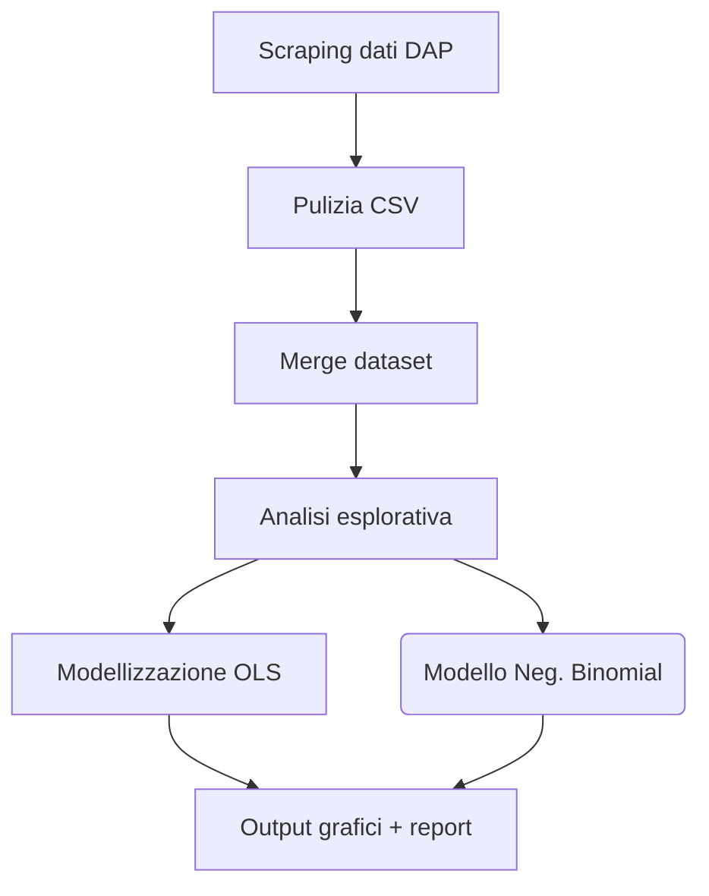

# 🚨 Analisi del Sovraffollamento Carcerario Italiano (2019‑2024)

> Studio quantitativo sul rapporto tra **capienza carceraria**, **condizioni di comfort** e **suicidi** nei penitenziari italiani.


---

## 🔗 Indice

- [Obiettivo](#obiettivo)
- [Dataset](#dataset)
- [Pipeline](#pipeline)
- [Struttura del progetto](#struttura-del-progetto)
- [Requisiti](#requisiti)
- [Installazione](#installazione)
- [Utilizzo](#utilizzo)
- [Risultati principali](#risultati-principali)
- [Licenza](#licenza)
- [Contributori](#contributori)

---

## 🎯 Obiettivo
Analizzare l’andamento del sovraffollamento carcerario italiano (2019‑2024) e la sua relazione con:

- **Indicatori di comfort** (dotazioni di bagni, docce, prese elettriche, spazi ricreativi).
- **Tasso di suicidi** tra i detenuti.

L’analisi utilizza modelli OLS e Negative Binomial con effetti fissi di istituto per stimare questi rapporti.

---

## 📊 Dataset

| Fonte | Descrizione | Periodo |
|-------|------------|---------|
| **Ministero della Giustizia – DAP** | Tabelle mensili PDF/HTML su capienza ufficiale e presenze | 2019‑2024 |
| **Report “Indicatori di comfort”** | Dotazioni strutturali (bagni, docce, prese) per istituto | 2024 |
| **Openpolis / Antigone** | Database pubblico sui suicidi in carcere | 2019‑2024 |

:point_right: I file grezzi sono salvati in `data/raw/`; i dataset ripuliti in `data/processed/`.

---

## ⚙️ Pipeline



1. **Scraping** con `requests`, `tabula‑py` e `pandas`.
2. **Pulizia** (standardizzazione nomi istituto, date, NA).  
3. **Merge** in `prisons_2019‑2024.csv`.  
4. **EDA** (trend mensili, heatmap regionali).  
5. **Modelli**: OLS & Negative Binomial (effetti fissi per istituto).  
6. **Output**: grafici in `reports/figures/` & sintesi modelli.

---

## 🗂️ Struttura del progetto

```text
.
├── data
│   ├── raw/
│   └── processed/
├── notebooks
│   └── Notebook finale.ipynb
├── reports
│   └── figures/
└── README.md
```

---

## 📦 Requisiti

- **Python ≥ 3.10**  
- **Java** (necessario per `tabula‑py`)

<details>
<summary>Dipendenze principali (pip)</summary>

```text
requests
tabula-py
pandas
numpy
matplotlib
seaborn
statsmodels
scikit-learn
scipy
```
</details>

---

## ⚡ Installazione

```bash
# 1 – Clona la repo
$ git clone https://github.com/tuo-utente/prison-overcrowding.git
$ cd prison-overcrowding

# 2 – Crea e attiva un virtualenv
$ python -m venv venv
$ source venv/bin/activate  # Windows: venv\Scripts\activate

# 3 – Installa le dipendenze
$ pip install -r requirements.txt
```

---

## 🚀 Utilizzo

### Modalità notebook

> Apri `notebooks/Notebook finale.ipynb` con Jupyter e segui le sezioni in ordine.

### Modalità script

```bash
$ python src/analysis.py
```

Al termine troverai:

- `data/processed/prisons_2019-2024.csv` – dataset finale.
- Grafici PNG/HTML in `reports/figures/`.
- Riepilogo modelli in `reports/model_summary.txt`.

---

## 📈 Risultati principali

| Indicatore | Valore |
|------------|--------|
| Sovraffollamento medio nazionale | **114 %** (picco 129 % a luglio 2023) |
| Correlazione Comfort ↔️ Sovraffollamento | β = ‑0.37 \| *p* < 0.01 |
| Effetto Sovraffollamento sui suicidi (NB) | **+6 %** suicidi per +10 pp di sovraffollamento |

---

## 📜 Licenza
Rilasciato con licenza **MIT** – vedi `LICENSE`.

---

## 🙋‍♀️ Contributori

- **Nome Cognome** – email@example.com

> Pull Request e segnalazioni di issue sono benvenute!

