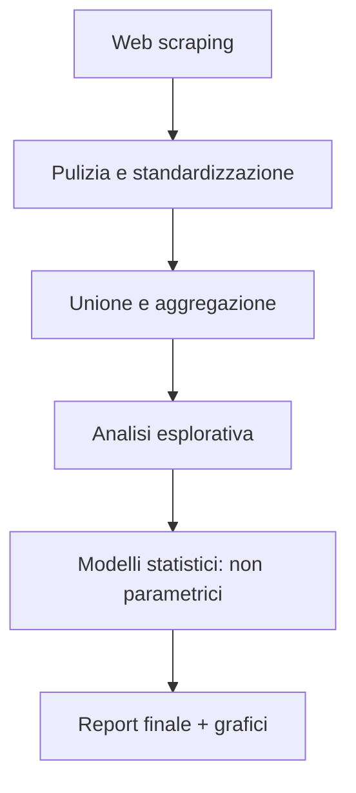

# 🚨 Analisi del Sovraffollamento Carcerario Italiano (2019–2025)

> Studio quantitativo sul rapporto tra **capienza carceraria**, **condizioni di comfort** e **suicidi** nei penitenziari italiani.


---

## 🔗 Indice

- [Obiettivo](#obiettivo)
- [Dataset](#dataset)
- [Pipeline](#pipeline)
- [Struttura del progetto](#struttura-del-progetto)
- [Requisiti](#requisiti)
- [Utilizzo](#utilizzo)
- [Risultati principali](#risultati-principali)
- [Licenza](#licenza)
- [Contributori](#contributori)

---

##  Obiettivo

Analizzare la relazione tra il **sovraffollamento carcerario** e l'**incidenza dei suicidi** nei penitenziari italiani (2019–2025).
Sono state testate correlazioni e causalità apparente con modelli **non parametrici** e applicando anche test di **Granger-causality**.

---

## 📊 Dataset

| Fonte | Descrizione | Periodo |
|-------|-------------|---------|
| **Ministero della Giustizia – DAP** | Dati mensili su capienza ufficiale e presenze | 2019–2025 |
| **Ristretti Orizzonti** | Eventi suicidari per istituto e anno | 2006–2025 |
| **Openpolis / Antigone** | Indicatori aggiuntivi di disagio | 2019–2024 |
| **Eurostat, ONS, Statista** | Dati comparativi europei | 2011–2024 |

I dati grezzi sono in `data/raw/`, quelli trattati in `data/processed/`.

---

## Pipeline



---

## 🗂️ Struttura del progetto

```text
.
├── data
│   ├── raw/
│   └── processed/
├── notebooks
│   └── Notebook finale.ipynb
├── reports
│   └── figures/
└── README.md
```

---

## 📦 Requisiti

- Python ≥ 3.10

<details>
<summary>Dipendenze principali</summary>

```text
requests
tabula-py
pandas
numpy
matplotlib
seaborn
statsmodels
scikit-learn
scipy
```
</details>

---


## 🚀 Utilizzo

### Notebook interattivo

Apri `notebooks/Notebook finale.ipynb` in Jupyter e segui le sezioni.

---

## 📈 Risultati principali

| Analisi | Risultato |
|--------|-----------|
| Sovraffollamento medio | 114 % (picco 129 % a luglio 2023) |
| Correlazione Spearman (Italia) | ρ = 0.238, *p* < 0.001 |
| Kendall’s Tau (Italia) | τ = 0.177, *p* < 0.001 |
| Granger-causality | Non significativa (*p* > 0.27) |
| Test Mann–Whitney U | *p* = 0.013 – sovraffollamento più alto negli istituti con suicidi |

---

## 📜 Licenza

Questo progetto è distribuito con licenza **MIT** – vedi `LICENSE`.

---

## 🙋‍♂️ Contributori

- Valerio Desiati
- Simone Rinaldi
- Gregorio Petruzzi

> Repo sviluppata per il corso di *Human Data Science* – Università di Bologna (DISI)
